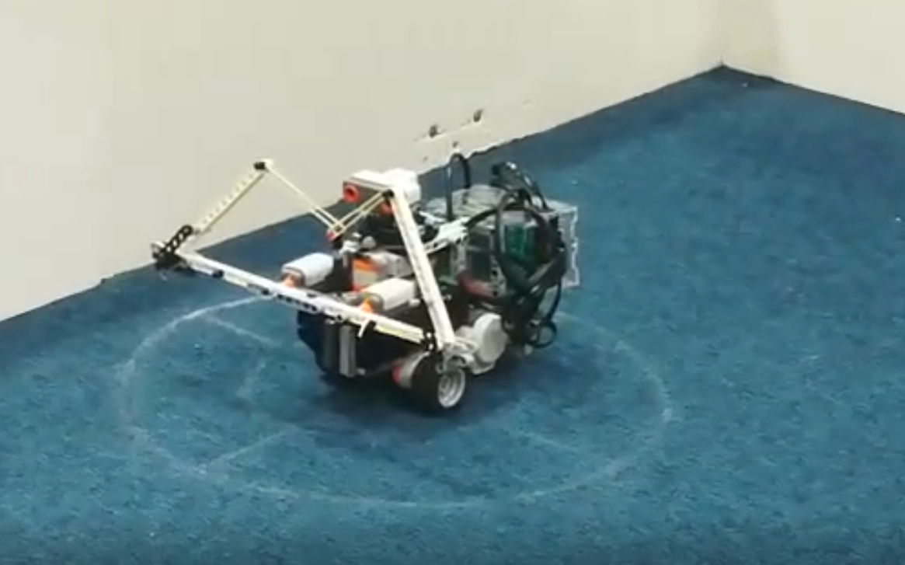

# Robotics

This repo is for [Robotics coursework](https://www.doc.ic.ac.uk/~ajd/Robotics/). The group size is five.

In this repo, we developed self-navigating robot using Monte Carlo Particle filter.\
By taking a probabilistic view of the real world, to model with its uncertainty.

The project has continuous assessment every week.

## What we did

### 1. Build the robot

The first thing we did is build the robot, of course, otherwise we are doing something truly magical.

* We designed our robot to be small for mobility.
* We also placed the sonar on a turntable with gear reduction at center of the rotation. This enables us to do an accurate scan of surrounding without causing new uncertainties.
* One thing we could improve is switch to a bigger wheel, this will decrease time required to complete the Final Competition. We had experienced problem with rapid change in rpd of motor, causing battery to shutdown. We worked around it with software fix.

### 2. Write particle model

The core piece of our software is the particle model, which can be found in `robotbase` class in `helper.py`.\
The particle model is able to:

1. Modulating uncertainties caused each move/rotation
2. Performs Monte Carlo Particle filter based on sonar measurement
3. Normalise and reproduce next generation of particles

The gif above shows how our particle filter performs when started by uniformly distributed around (180,42), but getting sonar reading as if it is at (190,42).\
Note that since the measurement were only taken in x direction, the particles converges to a line with x position being 190, but uncertain about its y position.

The code for this is under [`testLikelihood.py`](/week5/testLikelihood.py)

### 3. OOP

We used OOP as our programming model, this provisioning allowed us to simultaneously develop three approaches to the final competition while sharing the same codebase (`helper.py`).

## Final Competition

For the final competition, we thought out of box, invented a fordable extendible arm, which no other team had.\
It helped robot to swipe the whole map while stated within regulation (being 30cm in any direction when deployed).

As the result, our robot scored 92% of mark (third place), while being very entertaining.

<https://youtu.be/h3l0QkhQjNw>

## Workflow Management

### Commit message

Commit should start with

* __`BUG: `__ for bug fix
* __`WK{numer}: `__ for features related to assement in that week
* __`TOL: `__ for general productivity tools
* __`MIN:`__ for unimportant changes

Note that there is __a space__ after `:` for each per-fix. \
It then should be followed by short phrase describe what this commit is about.

### Branch setup

There will be four type of branches

* __master__ branch is for completed development
* __dev/{week_num}__ branch is for completed features for {week_num} week
* __fea/{week_num}/{task_name}__ branch is for incompleted feature for {week_num} week
* __tool__ branch is for general productivity tools

#### merge vs rebase

For cases below __merge__ should be used via pull-request and code review:

* `fea/{week_num}/{task_name}` to `dev/{week_num}`
* `dev/{week_num}`  to `master`, and at least one approval from another team member
* `tool` to `master`

For cases below __rebase__ should be used, to make history clear to read:

* pull from `master` to `dev/{week_num}`
* pull from `dev/{week_num}` to `fea/{week_num}/{task_name}`
* When pull from remote, use `git pull --rebase`

### User management

Even though we share only one raspberry pi as the brain for our robot. We should still create indicival account on the pi, such we could do modification simultaneously.

To achive this, there will be two type of account:

* __pi__ account for submission run, it should be keeped as clean environment. Not be used as dev account.
* __devs__ accounts for every teammate, it's for day to day develop stuff, no sudo it allowed.

### Dev environment

I would recommend everyone to VS Code with `Remote - SSH` extension. Set up git environment as you would on any Linux computer.

# Team Photo

